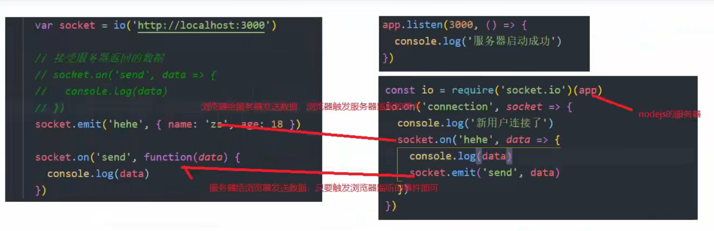

# websockt 

> 开启服务
>

# socket.io

主要为两个事件
> on /emit
> 
> on 负责接受事件
```js
 socket.on('事件名', data=> {
        // console.log(data); 数据
    })
```
> emit 负责发送事件
```js
 socket.emit('事件名字'，data => {
    
 })
```
> 两者相互配合



# test